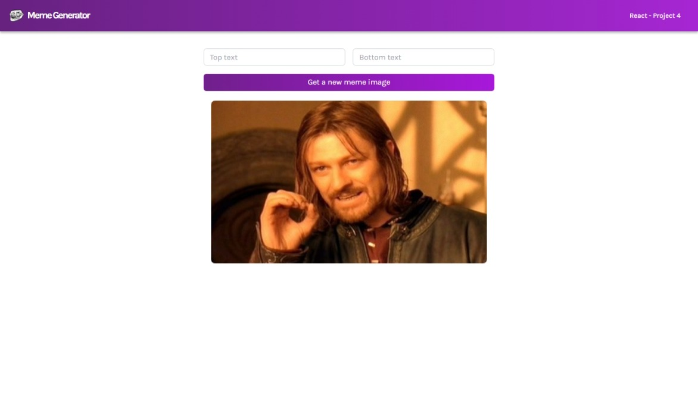
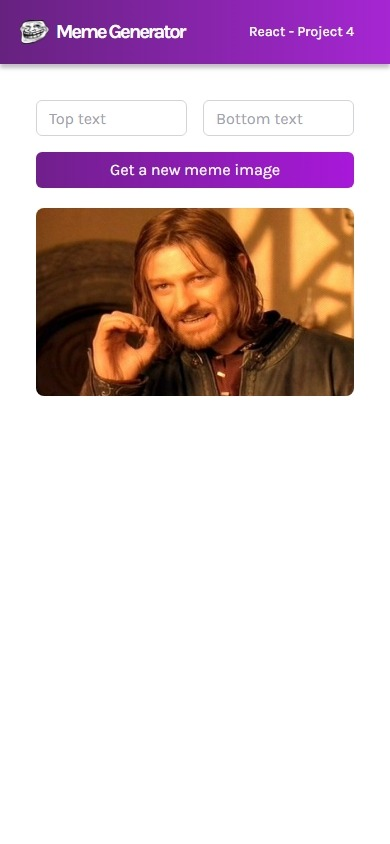

# React Project: meme generator
The meme-generator project is made with React. It is part of the React by Scrimba course, it is a basic project to learn about state handling in React, useEffect and work with API calls while managing the received data.
## Technologies used
* TailwindCSS 
* React 
* Vite 
## The challenge
The website must be able to display an image of a random meme obtained from the API, plus it must write over the image the text entered in the Top Text and Bottom Text fields. 
## Screenshots 

Desktop version

Mobile version
# [Website Live](https://meme-generator-henna-beta.vercel.app/)
## Auhor 
-   Email -  [cesararaujo.perez@gmail.com](mailto:cesararaujo.perez@gmail.com)
